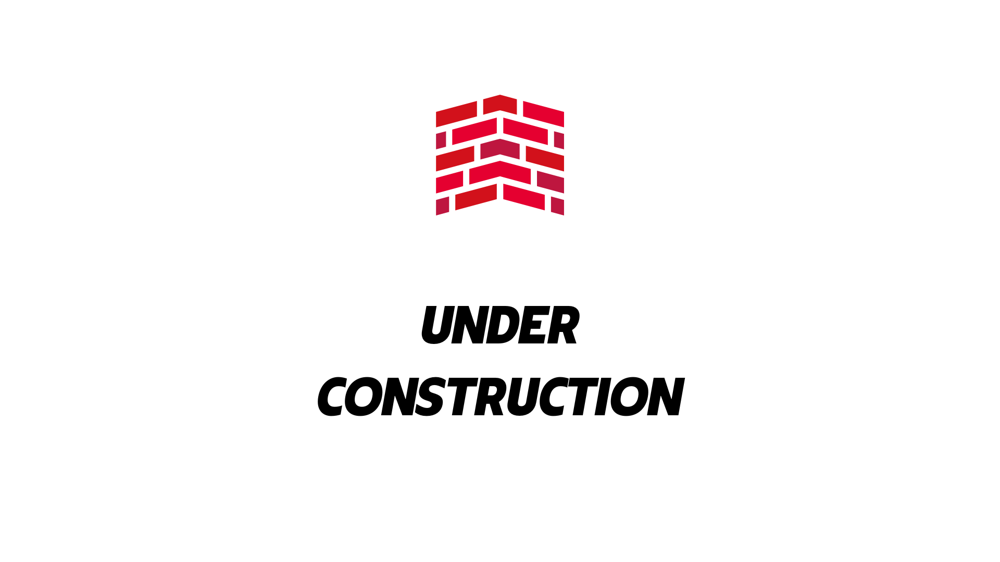

# UnderConstruction 
---
# 🏗 o que é o UnderConstruction?
É um conjunto de bibliotecas de clases que visa treinar e manipular exercícos executados pelo site Codewars. Atualmente feito em C# para treinamento de lógica de programação.

 

  
 
  
  
  
  
  

 # Tecnologias utilizazdas 
  ---
- C# (ASP NET Core 5)
